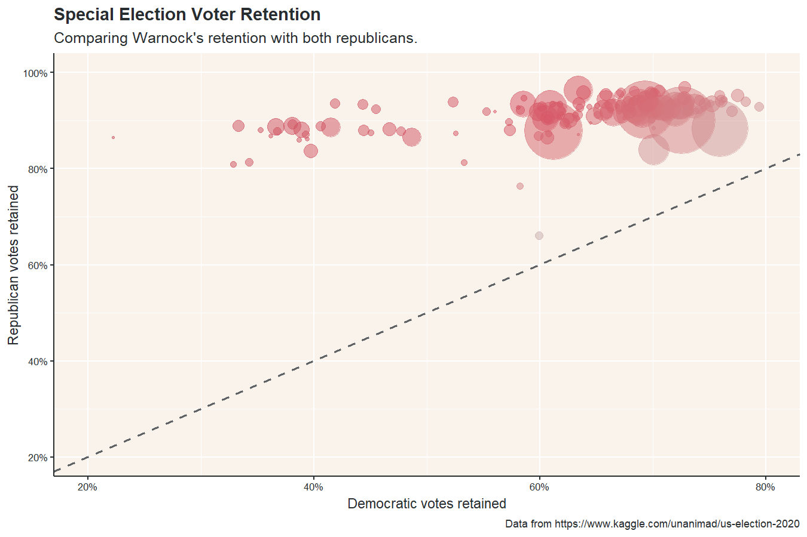
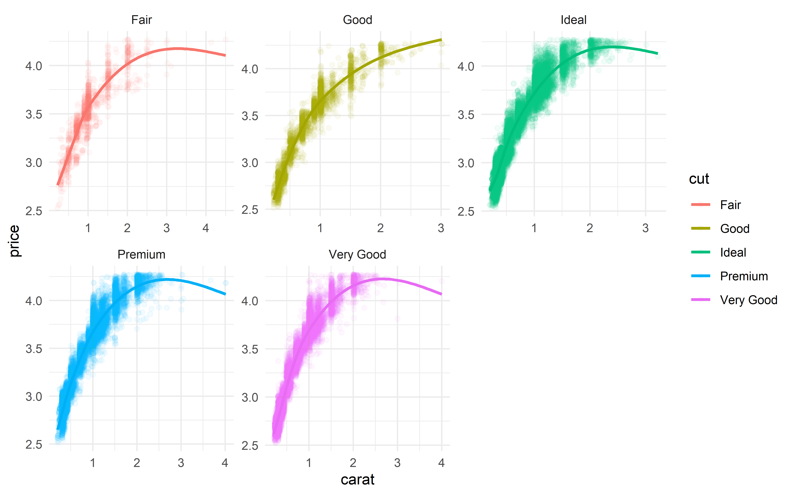
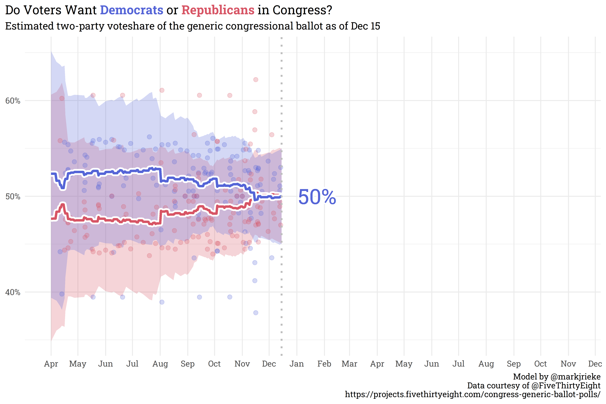

# the data diary

This is the home repository for [www.thedatadiary.net](https://www.thedatadiary.net), built with [Hugo](https://gohugo.io/) and the [Academia](https://github.com/themefisher/academia-hugo) theme, deployed using [Netlify](https://www.netlify.com/). 

The content on this site is released under the [MIT License](https://github.com/markjrieke/thedatadiary.net/blob/master/LICENSE).

Here is a selection of a few plots/posts I'm particularly proud of:

### [Doug Collins Saved Raphael Warnock's Senate Bid](https://www.thedatadiary.net/blog/2021-02-28-doug-collins-saved-raphael-warnock-s-senate-bid/)

### [aRtwork](https://www.thedatadiary.net/blog/2021-03-07-artwork/)

### [Diamonds are Forever: Feature Engineering with the Diamonds Dataset](https://www.thedatadiary.net/blog/2021-11-14-diamonds-are-forever-feature-engineering-with-the-diamonds-dataset/)

### [Do Voters want Democrats or Republicans in Congress?](https://www.thedatadiary.net/blog/2021-12-14-do-voters-want-democrats-or-republicans-in-congress/)

