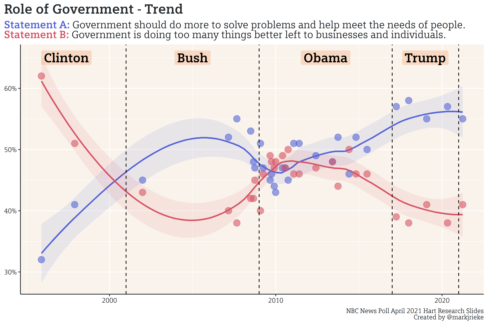

Elliot Morris wrote in his [newsletter last week](https://gelliottmorris.substack.com/p/are-preferences-for-more-government) about the increase in the public’s opinion that the government ought to be doing more. A summary of the last twenty years of polling by NBC shows that, while there seems to be a reactive effect based on the party of the president,  support for increased government activity has generally been on the rise. 

The combination of Biden’s [approval across several categories](https://www.pewresearch.org/politics/2021/03/11/biden-viewed-positively-on-many-issues-but-public-is-less-confident-he-can-unify-country/), [public support of his proposals](https://www.nytimes.com/2021/02/04/us/politics/biden-approval-rating-republicans.html) (with the exception of his original cap on refugees, which he then [raised after public outcry](https://www.cnn.com/2021/05/03/politics/refugee-cap/index.html)), and the public support of increased government activity gives Biden a strong argument in pressing congress to get his progressive policies pushed through to his desk. Despite the popularity, his $4 trillion [infrastructure and families plan](https://www.nytimes.com/2021/04/28/upshot/biden-families-plan-american-rescue-infrastructure.html) largely depends on what the senate parliamentarian will allow into a reconciliation bill (which only needs majority approval, rather than a filibuster-proof 60 votes) and the votes of a few moderate Democratic senators, since the bills will receive [no Republican support in the senate](https://nypost.com/2021/05/04/mcconnell-no-gop-senator-will-back-bidens-4-trillion-infrastructure-plan/). 

### Outlook for the Coming Weeks

I’ll be taking a break for the next few weeks, due to a flurry of weekend trips/weddings now that I/most of my friends are fully vaccinated. I’ll continue to work on the database in the background (notably, I need to dive deep into the census bureau demographic data, which needs a lot of fixing).  I’ll likely write a short update in either late May or early June. 

As always, you can find my work on [Github](https://github.com/markjrieke/thedatadiary/tree/main/2021.05.03-misc_ish).