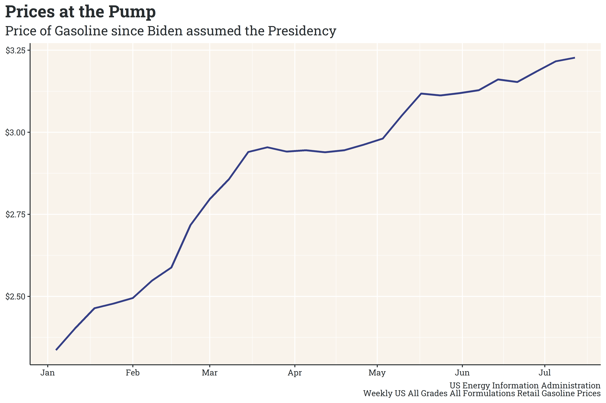
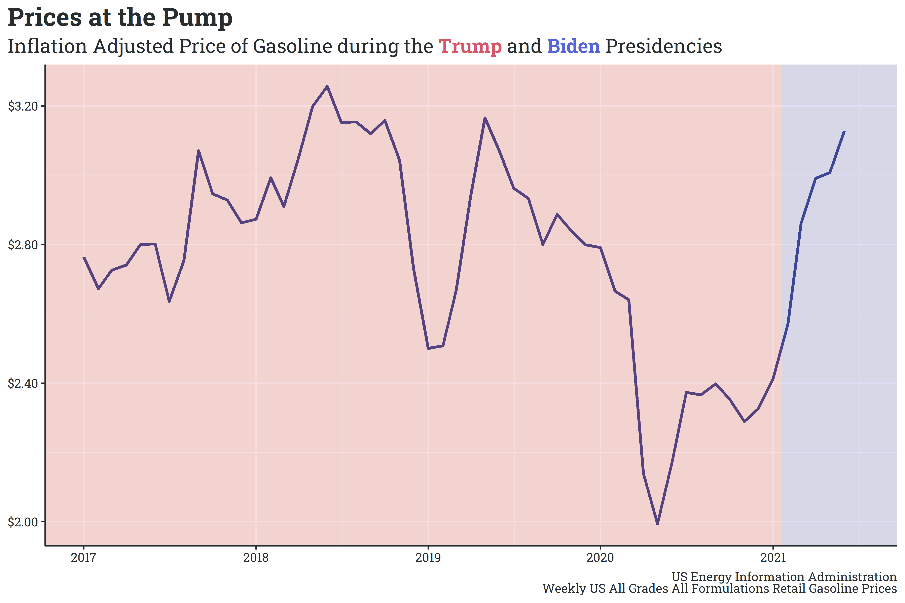

As America has vaccinated its population, life has seemingly begun to return to the pre-pandemic normal. Businesses have been opening to higher levels of capacity, schools are planning for higher levels of in-person learning in the fall, and, notably, Americans have returned to [pre-pandemic levels of transit](https://covid19.apple.com/mobility). 

[Conservative commentators](https://twitter.com/existentialfish/status/1377779116414533638) and [representatives](https://twitter.com/Jim_Jordan/status/1406966549714440196) have pointed out that prices of commodity goods - in particular, gasoline - have skyrocketed over the past year and attribute this increase to Biden’s presidency. Looking at retail gasoline prices, we can see a steady increase since Biden took office.

What they fail to point out, however, is that the price of gasoline (and other commodities) significantly dropped during the pandemic, and that the increases are largely a return to pre-pandemic prices.

While there are certainly opportunities to critique the current administration’s energy policy ([banning new drilling leases on federal land/water](https://apnews.com/article/joe-biden-billings-a3a37acf2fce55449b704b01badc1f67) and [canceling the Keystone XL pipeline’s border-crossing permit](https://apnews.com/article/donald-trump-joe-biden-keystone-pipeline-canada-environment-and-nature-141eabd7cca6449dfbd2dab8165812f2), for example), attributing the recent return to pre-pandemic gasoline prices is a particularly weak and intentionally misleading avenue of attack. 

As always, you can find my work on [github](https://github.com/markjrieke/thedatadiary).

### Some Reading/Viewing Material

* The Economist wrote an [interesting article](https://www.economist.com/graphic-detail/2021/07/10/in-person-voting-really-did-accelerate-covid-19s-spread-in-america) finding a significant link between a county’s in-person voting rate and new COVID cases in November.
* Elliot Morris summarized the work of several political scientists in a recent article describing [why the GOP slid so far towards authoritarianism](https://gelliottmorris.substack.com/p/why-did-the-gop-slide-so-far-towards) in the past decade. The article is behind a subscriber paywall, but is well worth the read. In short, however, “ethnically antagonistic” voters are much more likely to agree with statements traditionally viewed as authoritarian. This group hadn’t coalesced under a single party until Trump brought these anti-racial voters into the party (recall his role in the [birther conspiracy](https://www.theatlantic.com/ideas/archive/2020/05/birtherism-and-trump/610978/) and the [racial antagonism surrounding his 2016 campaign](https://www.cnn.com/2016/08/31/politics/2016-election-donald-trump-hillary-clinton-race/index.html)), at which point democratic (note, small “d”) norms became a partisan issue.
* In my machine learning class, I’ve started learning about the implementation of neural networks. The course’s instruction style is highly technical, but Grant Sanderson’s [series on neural networks](https://www.youtube.com/watch?t=1015s&v=aircAruvnKk) has helped me align a technical and intuitive understanding of the topic.