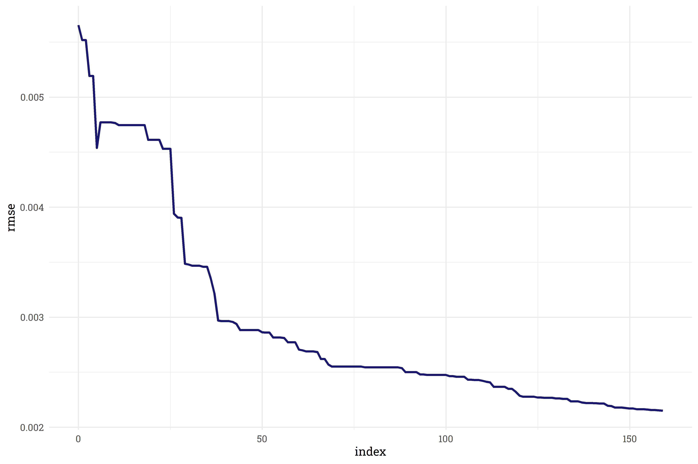
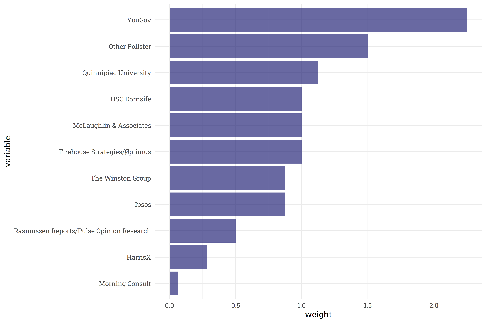
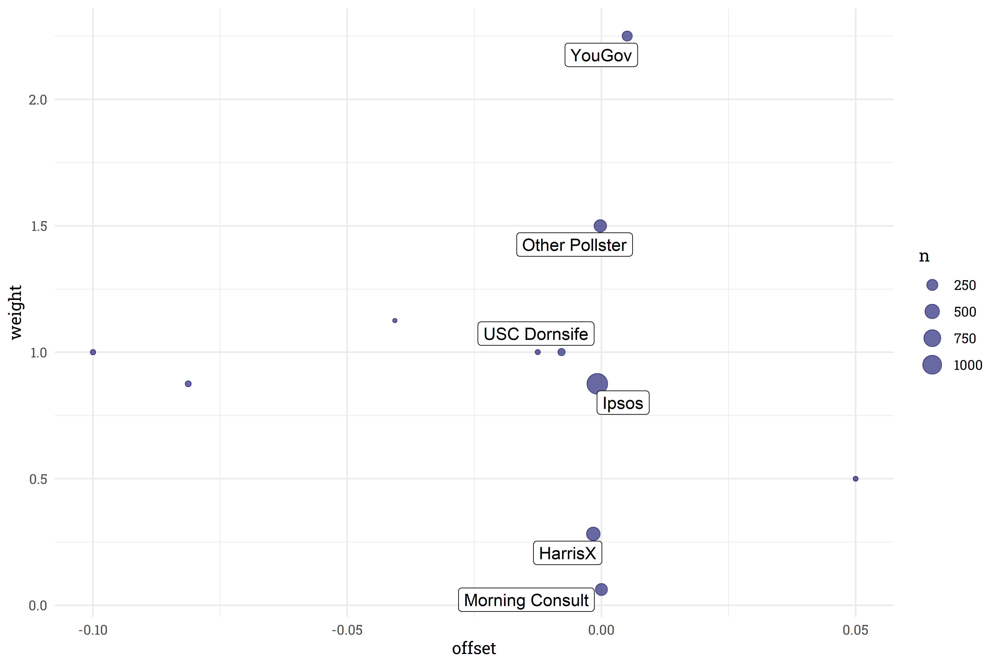
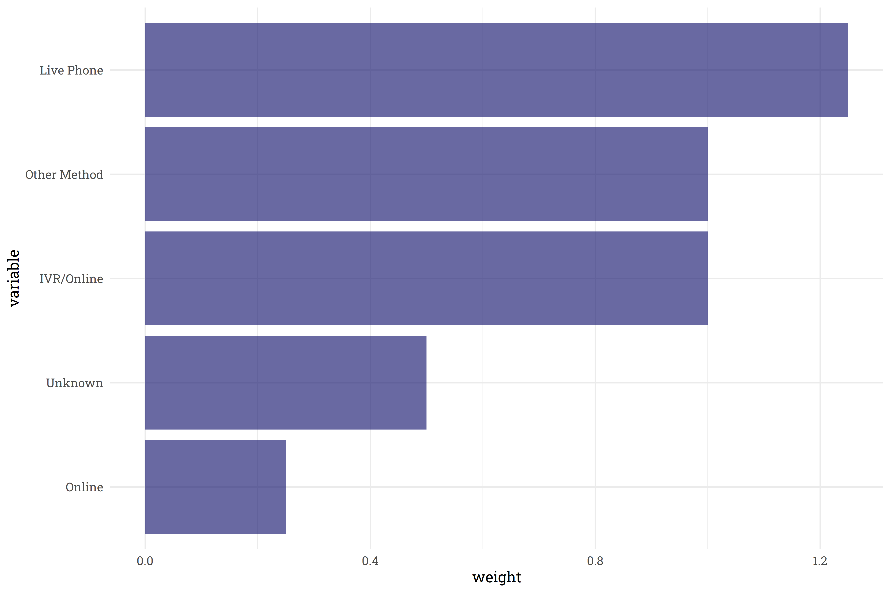
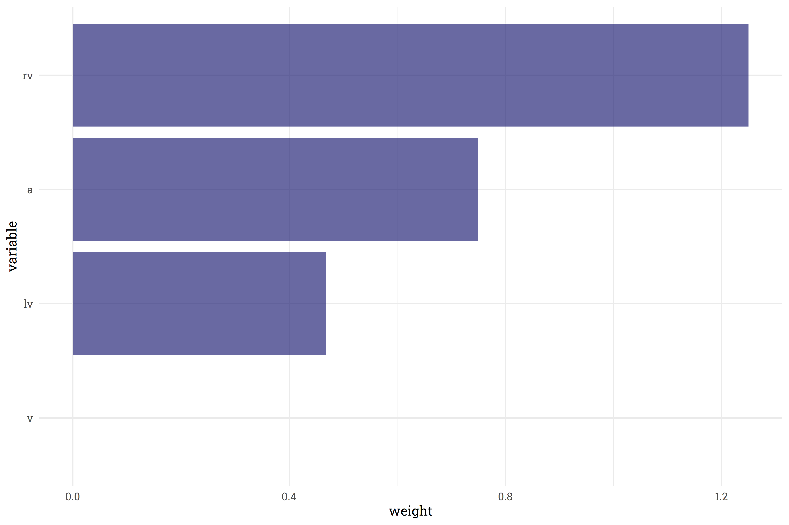
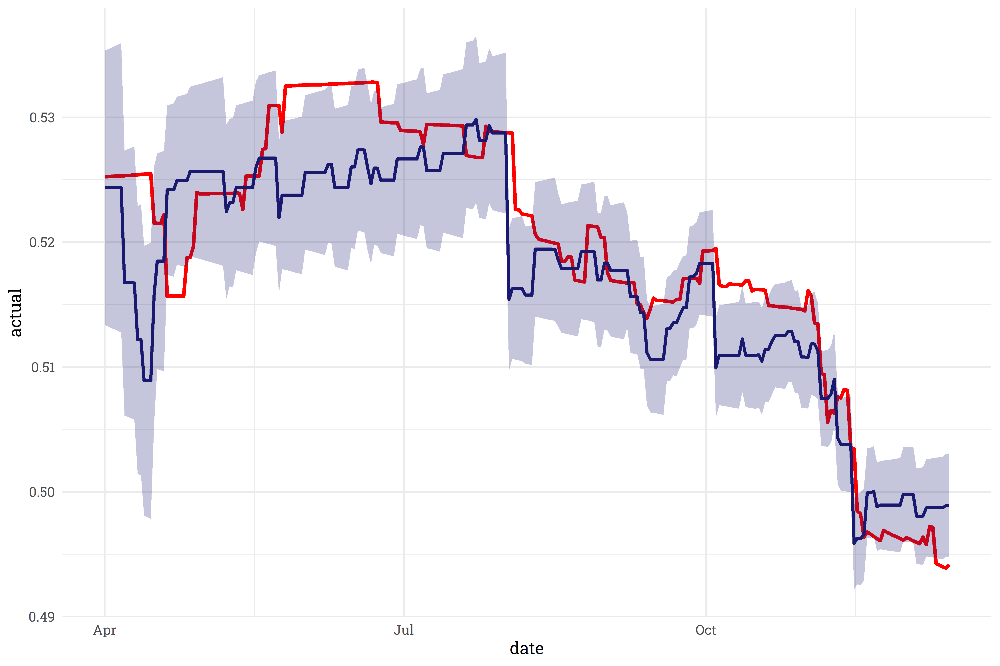
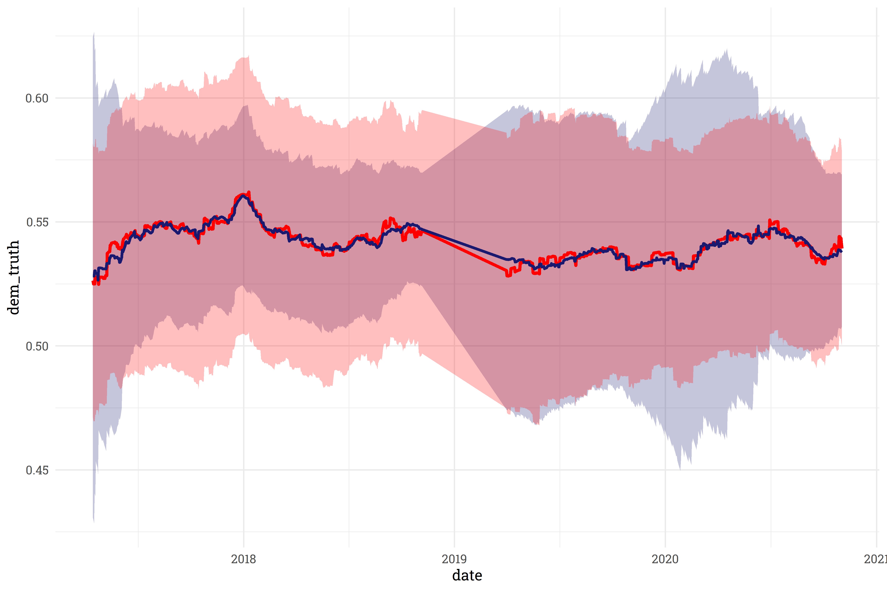
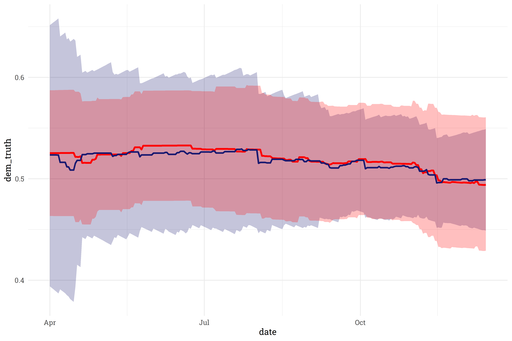

```{r setup, include=FALSE}
knitr::opts_chunk$set(echo = FALSE, warning = FALSE, message = FALSE, 
                      dpi = 500, fig.width = 9, fig.height = 6)
```

The 2022 midterms are still quite a ways away, however, in order to have a forecast ready in time, I need to start working on the model well in advance! One of the features I plan on using in the House Forecast is the [generic congressional ballot](https://www.pewresearch.org/politics/2002/10/01/why-the-generic-ballot-test/) average. Generic ballot polls ask respondents whether they intend to vote for either the Republican or Democratic candidate for the U.S. House of Representatives in their district. FiveThirtyEight provides a [daily updating polling average](https://projects.fivethirtyeight.com/congress-generic-ballot-polls/), but in order to project beyond their current day's average, I needed to build my own poll aggregator! Thankfully, they also are kind enough to provide the [underlying polling data](https://github.com/fivethirtyeight/data/tree/master/polls) as well. 

In this post, I'll walk through the steps taken to build the generic ballot aggregator and explore the results.

### The Gameplan

FiveThirtyEight's data only goes back for two election cycles, which doesn't provide enough data to build a poll aggregator from scratch. However, because they also provide their [historical trendline](https://projects.fivethirtyeight.com/generic-ballot-data/generic_ballot.csv), I can build a poll aggregator that fits the polling results to their historical trend. 

In addition to the topline result, each poll in FiveThirtyEight's repository includes quite a bit of additional meta-information about the poll: the pollster, sample size, survey methodology, and recipient population. Some pollsters, methodologies, and populations tend to be more accurate than others, so I'd be remiss to not include these features in the polling model. To incorporate all of this information, each feature will be weighted according to how well it fits FiveThirtyEight's historical average. I'm sweeping a lot of programmatic detail under the rug here, but in general, features that fit FiveThirtyEight's trendline well will have a higher weight and features that don't fit the trendline so well will have a lower weight. Finally, since we know that some pollsters tend to favor one party, we'll also create a "pollster offset" feature to shift each poll slightly and account for this partisan lean. 

Before digging any further, it may be beneficial to explore the polling repository a bit. Here's a sample of the polling data used for the aggregator:

```{r}
library(tidyverse)
library(riekelib)
library(lubridate)

set.seed(123)
read_csv("https://github.com/markjrieke/electiondata/raw/main/data/polls/src/fte/generic_ballot_polls_historical.csv") %>%
  mutate(end_date = as_date(end_date)) %>%
  filter(end_date < ymd("2021-01-01")) %>%
  select(cycle, display_name, sample_size, population, methodology, end_date, dem, rep) %>%
  slice_sample(n = 10) %>%
  rename(pollster = display_name) %>%
  knitr::kable()
```

The following pollsters conducted enough polls to warrant their own category - all other pollsters will be lumped together under the banner of "Other Pollster:"

```{r}
read_csv("https://github.com/markjrieke/electiondata/raw/main/data/polls/src/fte/generic_ballot_polls_historical.csv") %>%
  mutate(end_date = as_date(end_date)) %>%
  select(display_name) %>%
  rename(pollster = display_name) %>%
  percent(pollster, .keep_n = TRUE) %>%
  filter(pct > 0.01) %>%
  arrange(desc(pct)) %>%
  select(-pct) %>%
  knitr::kable()
```

Here is a bit of expanded detail on the survey population categories:

```{r}
read_csv("https://github.com/markjrieke/electiondata/raw/main/data/polls/src/fte/generic_ballot_polls_historical.csv") %>%
  select(population) %>%
  percent(population, .keep_n = TRUE) %>%
  arrange(desc(pct)) %>%
  select(-pct) %>%
  bind_cols(tibble(population_full = c("Registered Voters",
                                       "Likely Voters",
                                       "Adults", 
                                       "Voters"))) %>%
  relocate(population_full, .after = population) %>%
  knitr::kable()
```

Finally, the top survey methodologies considered are shown below. Similar to pollsters, methodologies that are not used enough are lumped into an "Other Methodology" category:

```{r}
read_csv("https://github.com/markjrieke/electiondata/raw/main/data/polls/src/fte/generic_ballot_polls_historical.csv") %>%
  select(methodology) %>%
  percent(methodology, .keep_n = TRUE) %>%
  filter(pct > 0.01) %>%
  mutate(methodology = replace_na(methodology, "Unknown")) %>%
  arrange(desc(pct)) %>%
  select(-pct) %>%
  knitr::kable()
```

The general plan of attack was to fit the polls to the trendline, measure the error, update the weights and offsets slightly, and repeat until the error is below an acceptable threshold. As time progresses, we make smaller and smaller updates to the weights and offsets we hone in on optimal values for minimizing error. 

### Exploring the Results

First and foremost, I'm pleased to report that the model fit the historical data fairly well. The model's trendline (in blue) reasonably matches FiveThirtyEight's historical trendline (in red):


As expected, as the model trains the weights and offsets, the `rmse` continues to shrink, and levels off just after 150 training rounds:



Some pollsters are better at fitting the trendline: YouGov polls end up with the highest weight in the model whereas Morning Consult polls are downweighted.



What are the partisan leanings of each pollster? Each pollster offset is shown below - pollsters at the top are *generally* more conservative leaning pollsters near the bottom are *generally* more liberal leaning. Or rather, pollsters near the top fit the trend better when we adjust their results to favor democrats, and pollsters near the bottom fit better when adjusted in favor of republicans. 


Some pollsters have fairly significant offsets! It's reassuring to note, however, that these pollsters are downweighted and don't make up the majority of polls recorded. The five pollsters with the most number of generic ballot polls conducted tend to fall fairly close to 0-offset.



Although [live phone polling has become more and more difficult](https://www.nytimes.com/2019/07/02/upshot/online-polls-analyzing-reliability.html) in recent years, it still ended up being the top-weighted method for the generic ballot poll.



Finally, surveying a population of registered voters turned out to be best for matching polls to the trendline, whereas the "voters" population was filtered away entirely (though that may be because there were only two polls conducted with this population).



### Fitting to New 2022 Data

This exploration of how the model fits to the training data is useful, but how well does this model fit to new data? As it turns out, fairly well! When fit to data it wasn't trained on, the model's trendline (in blue) closely follows the target trendline (in red).



This also gives us the ability to project *beyond* the current average! As we get further and further away from the current day, our confidence interval around the current average widens out.


This behavior looks great! One area of concern, however, is the area on the left - on days where we already have data, we're *way* too confident in our estimate! On some days, the confidence interval only spans 0.5%, which simply isn't realistic. 

To deal with this, we'll create a new feature, `downweight`, that we can train to widen our confidence interval to something more credible.

### One More Round of Training

Similar to training the generic ballot average, we can train the `downweight` feature to match the model's confidence interval to FiveThirtyEight's confidence interval. The trained result isn't a perfect fit, but this does give us a mathematically sound, consistent way to construct a more realistic confidence interval. Here's how the model's confidence interval compares to the training set:



On new data, the model similarly provides an okay-enough fit for our purposes. The model may find it difficult to recreate FiveThirtyEight's confidence interval due to differences in model construction. [According to FiveThirtyEight's documentation](https://fivethirtyeight.com/features/how-were-tracking-joe-bidens-approval-rating/) on other polling averages, it looks like they use an ensemble of [LOESS models](https://en.wikipedia.org/wiki/Local_regression), whereas I generate a single [beta distribution](https://en.wikipedia.org/wiki/Beta_distribution). Without getting too far into the weeds, the stack of LOESS models results in a confidence interval that is less prone to quick growth.



### Wrapping It All Up

Now that we've defined a model, we can finally answer the question in the title: do voters want Democrats or Republicans in congress? According to this model, voters are as even split as you can get!


Even if there was a leader in the polls, the generic ballot's predictive power this far out from the house elections is, to a first approximation, effectively useless. As we get closer to the election day, however, the polling model will become more and more useful. Additionally, the methods I used to generate the polling average can be replicated (with slight modifications) for other polling averages that will feed into the model, so stay tuned for more! 

### Some Programming Notes

I've skipped over quite a bit of programming detail. If you're so inclined, you can read through the [script to build the model and generate plots](https://github.com/markjrieke/electiondata/blob/main/scripts/generic_ballot_weighting.R). There's a *lot* going on there, but I'd like to highlight a few packages that were instrumental for putting this together:

* [`doParallel`](https://cran.r-project.org/web/packages/doParallel/index.html): I frequently use `doParallel`, which uses multiple cores running in parallel to speed up processes. Most of the time, loading `doParallel` is just done for convenience's sake, but it was absolutely necessary for this project --- even with parallel processing, each round of model training was lengthy. 
* [`furrr`](https://furrr.futureverse.org/): the goal of `furrr` is to combine `purrr`'s family of mapping functions with `future`'s parallel processing capabilities. Replacing my `purrr::map()` functions with `furrr::future_map()` functions literally cut training time in half.
* [`shadowtext`](https://github.com/GuangchuangYu/shadowtext): `shadowtext` is a small, niche package that allows you to add colored borders to `geom_text()` objects in a ggplot. It's not visible in today's chart because there's 100% overlap between democrats & republicans, but there's a white border around the text in front of the trendline that just looks nice.

