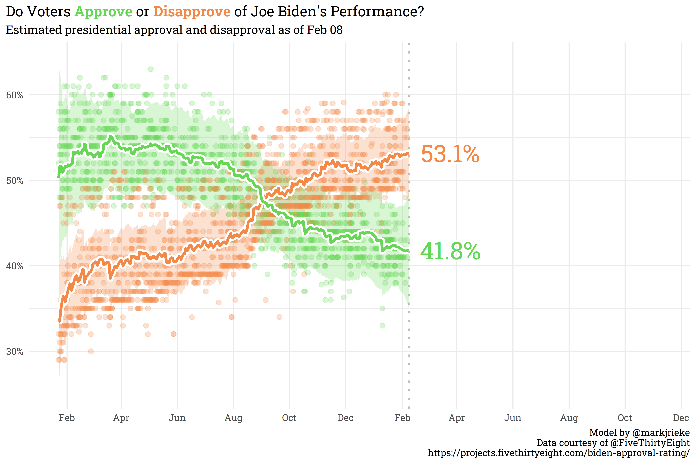

```{r setup, include=FALSE}
knitr::opts_chunk$set(echo = TRUE, warning = FALSE, message = FALSE, 
                      dpi = 500, fig.width = 9, fig.height = 6)

library(tidyverse)
library(tidymodels)
library(MetBrewer)

extrafont::loadfonts(device = "win")

theme_set(theme_minimal(base_family = "Roboto Slab") +
            theme(plot.background = element_rect(fill = "white", color = "white")))
```

**Note (3/14/22): This article was written prior to the release of the [{workboots}](https://github.com/markjrieke/workboots) package. Since the release of that package, I've discovered some errors with the methodology described here and would recommend instead referencing the [post associated with the release](https://thedatadiary.net/blog/2022-03-14-introducing-workboots).**

Statistical modeling sometimes presents conflicting goals. Oftentimes, building a model involves a mix of objectives that don't necessarily mesh well together: super-accurate point predictions, explainability, fast performance, or an expression of confidence in the prediction. In my work as an analyst, I generally am focused on how explainable the model is while being able to express a confidence interval around each prediction. For that, simple linear models do the trick. If, however, I want to regularize via `{glmnet}` (which --- with good reason --- [doesn't provide confidence intervals](https://stats.stackexchange.com/questions/224796/why-are-confidence-intervals-and-p-values-not-reported-as-default-for-penalized)) or use a non-linear model like `{xgboost}`, I have to drop the confidence interval around predictions. Or so I had previously thought! As it turns out, building a series of models from bootstrap resamples provides an alternative method of generating a confidence interval around a prediction.

### Setting a baseline with penguins

First, let's build out a baseline linear model with the Palmer Penguins dataset. This dataset contains information on 344 penguins across three species types and three islands. For this example, we'll use the penguin information to predict `body_mass_g`.  

```{r}
# load the data in from the tidytuesdayR package
penguins_src <- tidytuesdayR::tt_load(2020, week = 31)

# extract out the penguins dataset
penguins <- penguins_src$penguins
rm(penguins_src)

penguins
```

We'll need to do some lite preprocessing before we start modeling --- it looks like there are some `NAs` in `body_mass_g` and in `sex`. If I were creating a more serious model, I might keep the rows with `NAs` for `sex`, but since there are so few and this is an explainer, I'll just filter them out. 

```{r}
# remove NA from body_mass_g and sex
penguins <- 
  penguins %>%
  filter(!is.na(body_mass_g),
         !is.na(sex))

penguins
```

It's always good practice to explore the dataset prior to fitting a model, so let's jump into some good ol' fashioned EDA.

```{r}
# how are species/island related to body mass?
penguins %>%
  ggplot(aes(x = species,
             y = body_mass_g,
             color = species)) +
  geom_boxplot() +
  geom_point(alpha = 0.25,
             position = position_jitter()) +
  facet_wrap(~island)
```

Interesting! It looks like the Gentoo and Chinstrap species are only found on the Biscoe and Dream islands, respectively, whereas the Adelie species can be found on all three islands. At first glance, there's not a meaningful difference that Island has on the weight of the Adelie penguins, so I think we're safe to toss out the `island` feature and just keep `species`. 

```{r}
# how does sex relate to body mass?
penguins %>%
  ggplot(aes(x = sex,
             y = body_mass_g,
             color = sex)) +
  geom_boxplot() +
  geom_point(alpha = 0.25,
             position = position_jitter())
```

Unsurprisingly, male penguins are typically heavier than female penguins.

```{r}
# are penguins getting heavier or lighter as years progress?
penguins %>%
  mutate(year = as.character(year)) %>%
  ggplot(aes(x = year,
             y = body_mass_g)) +
  geom_boxplot() +
  geom_point(alpha = 0.25,
             position = position_jitter())
```

It doesn't look like there is significant signal being drawn from `year`, so we'll toss that out as well.

```{r}
# how do other body measurements compare with the total body mass?
penguins %>%
  select(bill_length_mm:body_mass_g) %>%
  pivot_longer(ends_with("mm"),
               names_to = "measurement",
               values_to = "value") %>%
  ggplot(aes(x = value,
             y = body_mass_g,
             color = measurement)) +
  geom_point(alpha = 0.5) + 
  facet_wrap(~measurement, scales = "free_x") +
  geom_smooth(method = "lm",
              se = FALSE)
```

For bill and flipper length, there's a pretty clear relationship, but it looks like bill depth has a *classic* case of [Simpson's paradox](https://en.wikipedia.org/wiki/Simpson%27s_paradox). Let's explore that further to find a meaningful interaction to apply.

```{r}
# which feature interacts with bill depth to produce simpson's pardox?
penguins %>%
  ggplot(aes(x = bill_depth_mm,
             y = body_mass_g,
             color = species)) +
  geom_point(alpha = 0.5) +
  geom_smooth(method = "lm",
              se = FALSE)
```

So, very clearly, the Gentoo species has a very different relationship between bill depth and body mass than the Adelie/Chinstrap species. We'll add this as an interactive feature to the model.

With all that completed, let's (finally) setup and build the baseline linear model with confidence intervals around the prediction!

```{r}
# remove features
penguins <- 
  penguins %>%
  select(-island, -year)

# split into testing and training datasets
set.seed(123)
penguins_split <- initial_split(penguins)
penguins_test <- testing(penguins_split)
penguins_train <- training(penguins_split)

# setup a pre-processing recipe
penguins_rec <- 
  recipe(body_mass_g ~ ., data = penguins_train) %>%
  step_dummy(all_nominal()) %>% 
  step_interact(~starts_with("species"):bill_depth_mm)

# fit a workflow
penguins_lm <- 
  workflow() %>%
  add_recipe(penguins_rec) %>%
  add_model(linear_reg() %>% set_engine("lm")) %>%
  fit(penguins_train)

# predict on training data with confidence intervals
bind_cols(penguins_lm %>% predict(penguins_train),
          penguins_lm %>% predict(penguins_train, type = "conf_int", level = 0.95),
          penguins_train) %>%
  ggplot(aes(x = body_mass_g,
             y = .pred)) +
  geom_point(alpha = 0.5) +
  geom_segment(aes(x = body_mass_g,
                   xend = body_mass_g,
                   y = .pred_lower,
                   yend = .pred_upper),
               alpha = 0.25) +
  labs(title = "Predicting the Palmer Penguins - Training",
       subtitle = "Linear model predicting a penguin's weight in grams",
       x = "Actual weight (g)",
       y = "Predicted weight (g)",
       caption = "Errorbars represent the a 95% confidence interval") +
  theme(plot.title.position = "plot")
```

This model does generally okay, but the confidence interval around each prediction is pretty [clearly too confident](https://mc-stan.org/rstanarm/articles/rstanarm.html)! Let's solve this with bootstrapping.

### What's a bootstrap?

Before progressing any further, it's probably important to define what exactly a bootstrap is/what bootstrapping is. Bootstrapping is a resampling method that lets us take one dataset and turn it into many datasets. Bootstrapping accomplishes this by repeatedly pulling a random row from the source dataset and, importantly, bootstrapping allows for rows to be repeated! Let's look at an example for a bit more clarity.

```{r, echo=FALSE}
example <- 
  tibble(rowid = c(1, 2, 3, 4, 5),
         x1 = c(0.8, 0.7, 0.9, 0.4, 0.3),
         x2 = c(104, 102, 88, 124, 79))

example %>%
  knitr::kable()
```

Let's say we want to make bootstrap resamples of this dataset. We'll draw five random rows from the dataset and, sometimes, we'll have the same row show up in our new bootstrapped dataset multiple times:

```{r, echo=FALSE}
example %>%
  filter(!rowid %in% c(2, 5)) %>%
  bind_rows(example[4, ],
            example[2, ]) %>%
  knitr::kable()
```

Another bootstrap dataset might look like this:

```{r, echo=FALSE}
example %>%
  filter(!rowid %in% c(1, 4)) %>%
  bind_rows(example[3, ],
            example[5, ]) %>%
  knitr::kable()
```

Bootstrap datasets allow us to create many datasets from the original dataset and evaluate models across these bootstraps. Models that are well informed will give similar outputs across each dataset, despite of the randomness within each dataset, whereas less confident models will have a wider variation across the bootstrapped datasets.

### Generating some confident penguins

Let's say we want to use `{xgboost}` to predict penguin weight and we'll use bootstrapping to generate a confidence interval. Firstly, we'll create the bootstrap datasets from our training set.

```{r}
penguins_boot <- penguins_train %>% bootstraps()

penguins_boot
```

By default, the `bootstraps()` function will create 25 bootstrap datasets, but we could theoretically create as many as we want. Now that we have our bootstraps, let's create a function that will fit a model to each of the bootstraps and save to disk. We'll use the default parameters for our `{xgboost}` model.

```{r}
# define a basic xgboost model
penguins_xgb <-
  boost_tree() %>%
  set_mode("regression") %>%
  set_engine("xgboost")

# function that will fit a model and save to a folder
fit_bootstrap <- function(index) {
  
  # pull out individual bootstrap to fit
  xgb_boot <- penguins_boot$splits[[index]] %>% training()
  
  # fit to a workflow
  workflow() %>%
    add_recipe(penguins_rec) %>%
    add_model(penguins_xgb) %>%
    fit(xgb_boot) %>%
    write_rds(paste0("models/model_", index, ".rds"))
  
}
```

This function will create a new model for each bootstrap, so we'll end up with 25 separate models. Let's fit!

```{r}
# fit to 25 bootstrapped datasets
for (i in 1:25) {
  
  fit_bootstrap(i)
  
}
```

Now let's define a function that will predict based on these 25 bootstrapped models, then predict on our training data.

```{r}
predict_bootstrap <- function(new_data, index){
  
  read_rds(paste0("models/model_", index, ".rds")) %>%
    predict(new_data) %>%
    rename(!!sym(paste0("pred_", index)) := .pred)
  
}

# predict!
training_preds <- 
  seq(1, 25) %>%
  map_dfc(~predict_bootstrap(penguins_train, .x))

training_preds
```

Now we have a column of predictions for each model --- we can summarise our point prediction for each row with the average across all models and set the confidence interval based on the standard deviation of the predictions.

```{r}
training_preds %>%
  bind_cols(penguins_train) %>%
  rowid_to_column() %>%
  pivot_longer(starts_with("pred_"),
               names_to = "model",
               values_to = ".pred") %>%
  group_by(rowid) %>%
  summarise(body_mass_g = max(body_mass_g),
            .pred_mean = mean(.pred),
            std_dev = sd(.pred)) %>%
  riekelib::normal_interval(.pred_mean, std_dev) %>%
  ggplot(aes(x = body_mass_g,
             y = .pred_mean)) +
  geom_point(alpha = 0.5) +
  geom_segment(aes(x = body_mass_g, 
                   xend = body_mass_g,
                   y = ci_lower,
                   yend = ci_upper),
               alpha = 0.25) +
  labs(title = "Predicting the Palmer Penguins - Training",
       subtitle = "XGBoost model predicting a penguin's weight in grams",
       x = "Actual weight (g)",
       y = "Predicted weight (g)",
       caption = "Errorbars represent the a 95% confidence interval") +
  theme(plot.title.position = "plot")
```

And just like that, we've trained a series of models with `{xgboost}` that let us apply a confidence interval around a point prediction! Now that we've done so on the training set, let's look at performance on the test set.

```{r}
seq(1, 25) %>%
  map_dfc(~predict_bootstrap(penguins_test, .x)) %>%
  bind_cols(penguins_test) %>%
  rowid_to_column() %>%
  pivot_longer(starts_with("pred_"),
               names_to = "model",
               values_to = ".pred") %>%
  group_by(rowid) %>%
  summarise(body_mass_g = max(body_mass_g),
            .pred_mean = mean(.pred),
            std_dev = sd(.pred)) %>%
  riekelib::normal_interval(.pred_mean, std_dev) %>%
  ggplot(aes(x = body_mass_g,
             y = .pred_mean)) +
  geom_point(alpha = 0.5) +
  geom_segment(aes(x = body_mass_g, 
                   xend = body_mass_g,
                   y = ci_lower,
                   yend = ci_upper),
               alpha = 0.25) +
  labs(title = "Predicting the Palmer Penguins - Testing",
       subtitle = "XGBoost model predicting a penguin's weight in grams",
       x = "Actual weight (g)",
       y = "Predicted weight (g)",
       caption = "Errorbars represent the a 95% confidence interval") +
  theme(plot.title.position = "plot")
```

The performance on the test data is slightly less accurate than on the training data, but that is to be expected. Importantly, we've used bootstrap resampling to generate a confidence interval from a model that otherwise normally returns a simple point prediction. 

### Some noteworthy caveats

The prediction interval above is all well and good, but it comes with some *hefty* caveats. Firstly, the confidence interval in the Testing plot is generated from the mean and standard deviation from each prediction. This assumes that the predictions are distributed normally, which may not necessarily be the case.

```{r}
training_preds %>%
  slice_head(n = 1) %>%
  pivot_longer(starts_with("pred")) %>%
  ggplot(aes(x = value)) +
  geom_density()
```

This density plot for one of the predictions shows that there's definitely some non-normal behavior! There's a few ways of addressing this.

1. Create many, many, more bootstraps and models so that the prediction distribution approaches normality (with only 25 points, we really shouldn't even expect normality from this example). 
2. Report out the actual values of the percentiles in the distribution (e.g., the 2.5% percentile is below X, 97.5% is above Y, and the mean is at Z).
3. Report out the actual distribution as the result.

Ideally, you should do all three.

The second major caveat is that this is not one model, but a whole host of models and these take up a large amount of disk space. In this example, our 25 models take up 25 times more space than our original model and it takes some time to read in, fit, and wrangle the results. We can trade disk space for computation time by writing a function that fits and predicts without saving a model, but again, that's a tradeoff between speed and space. For linear models, it may be a better route to have STAN simulate thousands of results via `{rstanarm}` or `{brms}`, but for non-linear models, boostrapping is the best way to go for now!

### Polling Bites

Currently, the Generic Ballot is holding steady with a slight sliver more Americans wanting Republicans in Congress than Democrats (**50.7%** to **49.3%**, respectively). Joe Biden's net approval continues to slide, currently sitting at **-11.4%** (**41.8%** approve, **53.1%** disapprove).




