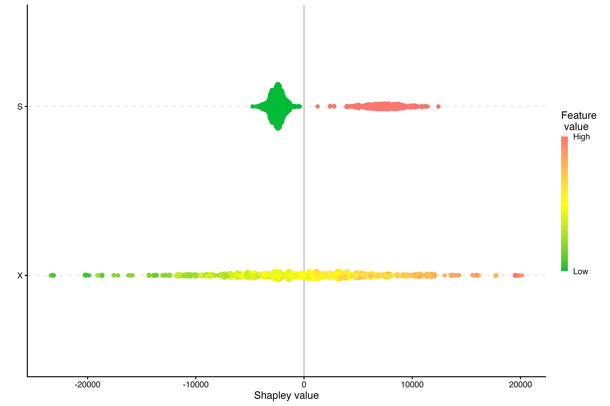
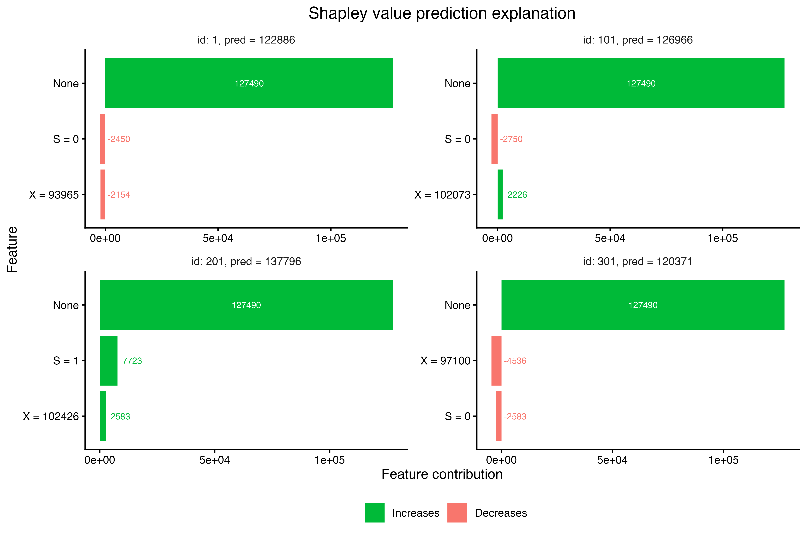

You shouldn't use [Shapley values](https://shap.readthedocs.io/en/latest/example_notebooks/overviews/An%20introduction%20to%20explainable%20AI%20with%20Shapley%20values.html). At best, they yield uninterpretable nonsense and don't add anything of value to a predictive model. At worst, they can actively harm your causal interpretation, even with a well-specified causal model. Shapley values _fundamentally cannot_ provide interpretable evidence that can be used to inform a decision.

If you disagree, I'd like to issue a challenge. Here is the Shapley plot for a well-specified causal model that correctly estimates the treatment effect of daily ad spend, $X$, conditional on seasonal effects, $S$. Given these results, would you recommend increasing ad spend, decreasing ad spend, or leaving it unchanged from the current average of $100,000 per day? If you think it should be changed, how much would you change it by and how much do you think the daily revenue will change? I'll give you the answers at the end, but if you're an ardent defender of Shapley values, I'd urge you to jot your answers down ahead of time.



Let's setup the scenario that was used to generate the plot above. Say you work in marketing with an annual budget of ~\$36M. On average, you can spend ~\$100,000 per day, though it's expected that this will fluctuate due to uncertainty in cost per impression and demand uncertainty. Your marketing spend, $X$, will have a direct effect on total sales, $Y$.

It's also reasonable to assume that marketing spend will increase traffic to your company's website, $W$, which will in turn increase sales. This gives an indirect causal pathway through $W$, $X \rightarrow W \rightarrow Y$.

Finally, let's assume that your company specializes in ed-tech and sees seasonal effects during summer months. If we expect this seasonal effect to affect total sales directly and indirectly through $W$, our resulting [DAG](https://en.wikipedia.org/wiki/Directed_acyclic_graph) looks like this:^[This DAG also gets to live in the magical world in which there are no unobserved confounders.]

```{r}
#| fig-height: 2.5
library(tidyverse)
library(xgboost)
library(ggdag)
library(riekelib)

coords <-
  list(
    x = c(X = 0, Y = 1, W = 0.5, S = 1),
    y = c(X = 0.5, Y = 0.5, W = 0, S = 0)
  )

dagify(
  Y ~ X + W + S,
  W ~ X + S,
  exposure = "X",
  outcome = "Y",
  coords = coords
) %>%
  tidy_dagitty() %>%
  ggplot(aes(x = x,
             y = y,
             xend = xend,
             yend = yend)) +
  geom_dag_edges() +
  geom_dag_node(alpha = 0) +
  geom_dag_text(family = "serif",
                fontface = "italic",
                color = "black",
                size = 14) +
  theme_dag()
```

If I simulate data according to this DAG, I get the following daily revenue plot with spikes in revenue every summer. The details of the simulation aren't particularly important^[For simplicity's sake, this is just a rote linear model. I didn't include the nonlinear [MMM](https://www.pymc-marketing.io/en/0.15.1/guide/mmm/mmm_intro.html)-specific adstock and saturation transformations. For an introduction into these concepts and MMMs in general, I recommend [Google's 2017 paper](https://storage.googleapis.com/gweb-research2023-media/pubtools/3806.pdf) on the subject.] aside from knowing that the **true causal effect of $X \rightarrow Y$ is 1.15**.

```{r}
start_date <- mdy("1/1/2021")
end_date <- mdy("12/31/2025")

# randomize daily media spend
avg_daily_spend <- 100000
std_daily_spend <- 5000

# need to identify the summer
summer_months <- 6:8

# media spend and seasonality affect webiste traffic
b_XW <- 4
b_SW <- 100000
std_W <- 50000

# media spend, website traffic, and seasonality affect total sales
alpha <- 10000
b_XY <- 0.75
b_WY <- 0.1
b_SY <- 0
std_Y <- 5000

# what's our _actual_ causal effect from X -> Y
ATE <- b_XY + b_XW * b_WY

set.seed(1234)
sales <- 
  tibble(date = seq.Date(from = start_date, to = end_date, by = "day")) %>%
  bind_cols(X = rnorm(nrow(.), avg_daily_spend, std_daily_spend)) %>%
  mutate(S = if_else(month(date) %in% summer_months, 1, 0)) %>%
  bind_cols(W = rnorm(nrow(.), b_XW * .$X + b_SW * .$S, std_W)) %>%
  bind_cols(Y = rnorm(nrow(.), alpha + b_XY * .$X + b_SY * .$S + b_WY * .$W, std_Y))


sales %>%
  ggplot(aes(x = date,
             y = Y)) + 
  geom_point(alpha = 0.25,
             shape = 21) +
  geom_smooth(method = "loess",
              span = 0.15) +
  scale_y_comma() +
  theme_rieke() +
  labs(x = NULL,
       y = NULL)
```

```{r}
# what's the effect of a marginal spend increase?
ame <- function(model, marginal_spend = 10000) {
  
  tibble(condition = c("treatment", "control"),
         data = c(list(sales %>% mutate(X = X + marginal_spend)), list(sales))) %>%
    mutate(outcomes = map(data, ~model %>% predict(newdata = .x, type = "response"))) %>%
    select(outcomes, condition) %>%
    pivot_wider(names_from = condition,
                values_from = outcomes) %>%
    mutate(delta = pmap(list(treatment, control), ~..1 - ..2),
           ATE_est = map_dbl(delta, mean) / marginal_spend,
           ATE_true = ATE) %>%
    select(starts_with("ATE"))
  
}

rmse <- function(model) {
  
  sales %>%
    bind_cols(.fitted = model %>% predict(newdata = sales)) %>%
    yardstick::rmse(truth = Y, estimate = .fitted) %>%
    rename(rmse = .estimate) %>%
    select(rmse)
  
}

fit_summary <- function(model) {
  
  ame(model) %>%
    bind_cols(rmse(model)) %>%
    mutate(across(everything(), ~round(.x, 2))) %>%
    knitr::kable()
  
}
```

If we want to estimate the causal effect of $X \rightarrow Y$ with a model, we would only fit $Y \sim f(X + S)$.[^independence] Because there's a causal pathway $X \rightarrow W \rightarrow Y$, we wouldn't want to include $W$ in the model, since including it would "take away" some of the total effect. By excluding $W$ from the model, we recover the true causal effect.^[Or, well, close enough.]

[^independence]: In this case, we could also estimate the causal effect with just $Y \sim f(X)$, since $S$ is conditionally independent from $X$. I include it here since it helps with estimation, but excluding still recovers the ATE:
    ```{r}
    #| code-fold: false
    fit <- lm(Y ~ X, data = sales)
    fit_summary(fit)
    ```

```{r}
#| code-fold: show
causal_lm <- lm(Y ~ X + S, data = sales)
fit_summary(causal_lm)
```

But! If we only care about _prediction_, we can definitely include $W$ in the model. By doing so, we sacrifice our causal interpretation for a better predictive score.^[Ideally, you'd want to look at out of sample scoring functions, cross-validate, yadda, yadda, yadda.]

It's really important to pause here and really hammer home this point. We've traded a causal interpretation for a better predictive model. **It is a fruitless endeavor base make decisions based on the features of a predictive model.** They don't mean anything, they're just mathematical constructs that happen to produce a better predictive function.

```{r}
#| code-fold: show
predictive_lm <- lm(Y ~ X + S + W, data = sales)
fit_summary(predictive_lm)
```

Causal diagrams specify the causal relationship of the data generating process but not the statistical relationship. There's nothing stopping us from swapping out the simple linear model for a more complex model. Here, I fit a boosted tree to the same dataset and recover the ATE.^[XGBoost should be reserved for relatively large datasets and is actually a particularly poor choice for this dataset (~1,800 observations). If using XGBoost for estimating causal effects in a real setting, you'd want to tune the stochastic parameters, then use a few thousand [bootstrap](https://en.wikipedia.org/wiki/Bootstrapping_(statistics)) fits to summarize a distribution of ATEs with an uncertainty interval. For this example, I just seed-hacked to something reasonable, but the causal XGBoost _does_ converge on the true ATE as sample size increases.]

```{r}
#| code-fold: show
causal_xgb <- xgboost(x = sales[c("X", "S")], y = sales$Y)
fit_summary(causal_xgb)
```

Similarly, we can use XGBoost to fit a predictive model that includes all available variables for an improvement in our predictive scoring function, again at the cost of any causal interpretation.

```{r}
#| code-fold: show
predictive_xgb <- xgboost(x = sales[c("X", "S", "W")], y = sales$Y)
fit_summary(predictive_xgb)
```

All this has been an exhaustive setup in order to be able to contrast with Shapley values the utility we get from our casual estimand and the predictive scoring function. Estimating the marginal effect of some treatment given a well specified causal model lets us make decisions that intervene in the system. The predictive score for a fitted model lets us evaluate the model's performance against other models. The Shapley values tell us... not a whole lot.

Here's the same Shapley plot from beforehand, based on the causal XGBoost model. What does it tell us? Well, we can see that as $X$ increases, so too does the Shapley value.^[Though we have to infer this from color.] But it doesn't tell us any useful information that we can use to make a decision. How much should we increase ad spend? Who knows! What should we expect revenue to be if we increase revenue? Who knows!

```{r}
#| eval: false
# shapley values for a causal model are actively harmful!!!
causal_explain <-
  shapr::explain(
    causal_xgb,
    x_explain = sales[c("X", "S")],
    x_train = sales[c("X", "S")],
    phi0 = mean(sales$Y),
    approach = "ctree",
    verbose = c("basic", "progress", "convergence", "shapley", "vS_details")
  )

plot(causal_explain, plot_type = "beeswarm")
```


A particularly pernicious side effect of how Shapley values are presented is that, if someone takes them seriously, they can delude themselves into the exact wrong course of action. In the chart above, the Shapley values for $X$ are centered around 0. So does that mean that media spend, on average, doesn't affect total sales? Of course not! But that's what a beeswarm plot of Shapley values implies.

It's even more problematic when looking at the Shapley values of individual observations. Here, I've selected 4 individual days. By far, the biggest contribution to total revenue is... nothing! In this set of examples, spending over \$100k on ads only contributes an additional ~\$2,500 to daily revenue. Spending less than \$100k actually _detracts_ from our estimated revenue!^[I should note that this is _not_ an artifact of the tree-based model. We get basically the exact same plot if we look at the Shapley contributions based on the `causal_lm` model.] If we were to take Shapley values at face value,^[Geddit??] a reasonable conclusion would be to avoid spending our \$100k daily budget and only suffer minor losses relative to the massive benefit of doing nothing. 

```{r}
#| eval: false
plot(causal_explain, plot_type = "bar", index_x_explain = c(1, 101, 201, 301))
```



**Looking at Shapley values leads to the exact wrong conclusion.** Based on our estimated ATE, we should expect around a 15% marginal ROI for every incremental dollar spent, so we should _definitely_ increase our media spend, not set it to $0 as the Shapley values might imply.

If you're looking to dump Shapley values,^[Which you should, if you haven't already.] please don't replace it with another arbitrary "interpretable machine learning" metric, like [LIME](https://christophm.github.io/interpretable-ml-book/lime.html).

For causal models, you can just define your quantity of interest and estimate the [marginal effect](https://marginaleffects.com/).^[This is how I've been estimating ATE for each model.] Marginal effects are model-agnostic, actually answer a question you care about (what happens if I increase spend?), and puts the answer in familiar terms (in this case, dollars).

For predictive models, individual feature contributions and feature "importance" _shouldn't_ be a quantity of interest --- you really just need to care about how well your model predicts. But you can use [partial dependency plots](https://christophm.github.io/interpretable-ml-book/ice.html) to look at how adjusting an individual variable changes the predicted values.^[Guess what --- PDPs are just marginal effects. ] Or you can generate predictions on new data that you care about. Either way, just remember that predictive models don't hold up under intervention, so adjusting your decision to maximize the output of a predictive model isn't a good idea.

In summary, Shapley values are bad. Don't use them.
